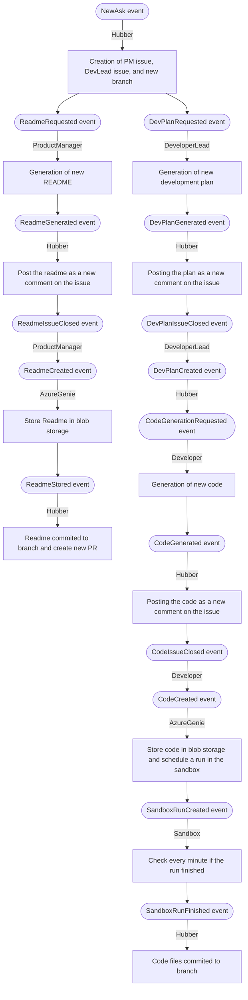

# GitHub Dev Team with AI Agents

This project is a **demonstration application** that serves as a starting point for further customization and development.
It showcases how to integrate AI and programmatic agents into a distributed application utilizing existing external resources. 

The application leverages GitHub's existing user interface and infrastructure of **events** and **webhooks** to connect with the DevTeam application.
Azure blob storage is used to store intermediate artificts, such as READMEs and code files, while the **Azure Genie** service is used to run the code in a sandbox environment.
A vector database is used to store and retrieve additional knowledge relevant to the users's request and agent's functionality.

> **Note**: This project is an experiment and is not intended to be used in production as is.

---

## Background

The workflows in this application are designed to closely resemble **traditional development workflows**, making it easier for humans and agents to collaborate effectively.
By mirroring familiar processes, the application facilitates seamless interaction between human users and AI agents.

For example, the application uses **GitHub issues and comments** as the primary collaboration mechanism.
This is very similar to how traditional development teams interact, where issues are used to track tasks and comments are used for discussions and feedback.
GitHub's design reflects these traditional workflows, making it an ideal interface for this demonstration.

The intent is to enable users to interact with the DevTeam agents in a way that feels natural and intuitive, just as they would with a human development team. From a natural language specification, users can initiate tasks such as:
- Writing unit tests
- Expanding pipelines
- Creating pull requests for specific intents
- Developing new features
- Building an application from scratch

The system supports **chain-of-thought coordination**, allowing agents to collaborate across multiple reasoning trees to achieve the user's goals.
Each agent specializes in a specific aspect of the development process, such as:
- Architecture and task breakdown
- Development planning
- Code generation and review
- Documentation and testing
- Deployment and validation

By following these workflows, the application demonstrates how AI agents can augment traditional development teams, enhancing productivity and streamlining processes while maintaining a familiar collaboration model.

---

## Get it running

Check [the getting started guide](./docs/github-flow-getting-started.md).

## Demo

https://github.com/microsoft/azure-openai-dev-skills-orchestrator/assets/10728102/cafb1546-69ab-4c27-aaf5-1968313d637f

## Solution overview

## How it works

The **GitHub repository** serves as the **user interface** for interacting with the DevTeam system.
Users and the DevTeam agents communicate through **GitHub issues** and **comments**.
The workflow is as follows:

1. **User Interaction**:
   - The user creates a GitHub issue with the `Do.It` label to initiate a task.
   - The issue body contains the user's natural language request or description of the task.
   - The user interacts with the DevTeam by posting comments on the issues created by the system.

2. **DevTeam Interaction**:
   - The DevTeam agents create additional issues and post comments to those issues as their interaction mechanism with the user.
   - These interactions are triggered by **external events** (e.g., issue creation, issue comments) and processed by the `GithubWebHookProcessor`.

3. **Event-Driven Workflow**:
   - External GitHub events (e.g., issue creation, issue comments) trigger internal DevTeam messages (e.g., `NewAsk`, `ReadmeRequested`).
   - Internal messages facilitate communication between agents to complete tasks such as generating READMEs, development plans, and code.

---

### Example Workflow

1. The user creates an issue with the `Do.It` label and describes the task.
2. The `Hubber` agent processes the issue and creates additional issues for the `ProductManager` and `DeveloperLead` agents.
3. The `ProductManager` agent generates a README and posts it as a comment on the PM issue.
4. The user reviews the README and provides feedback via comments or approval by closing the issue.
5. Once approved, the README is stored, and the workflow proceeds to the next stage (e.g., plan generation & development).

---

### Roles of the Agents

- **Hubber**: Coordinates tasks, creates branches, and manages issues.
- **ProductManager**: Generates READMEs based on user input.
- **DeveloperLead**: Creates development plans and assigns subtasks to developers.
- **Developer**: Generates code for specific subtasks.

* * User begins with creating an issue and then stateing what they want to accomplish, natural language, as simple or as detailed as needed.
* Product manager agent will respond with a Readme, which can be iterated upon.
  * User approves the readme or gives feedback via issue comments.
  * Once the readme is approved, the user closes the issue and the Readme is commited to a PR.
* Developer lead agent responds with a decomposed plan for development, which also can be iterated upon.
  * User approves the plan or gives feedback via issue comments.
  * Once the plan is approved, the user closes the issue and the plan is used to break down the task to different developer agents.
* Developer agents respond with code, which can be iterated upon.
  * User approves the code or gives feedback via issue comments.
  * Once the code is approved, the user closes the issue and the code is commited to a PR.

